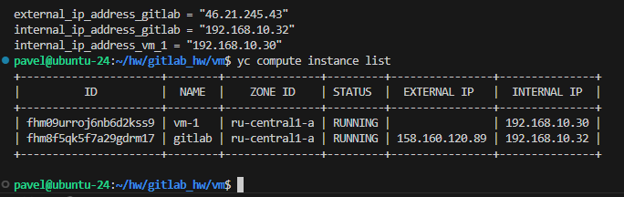
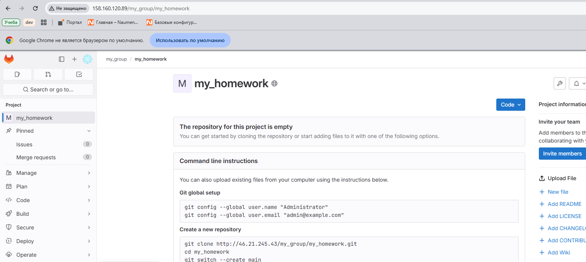
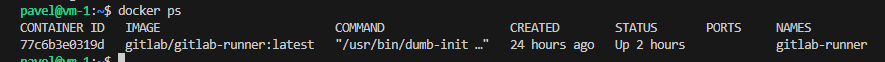
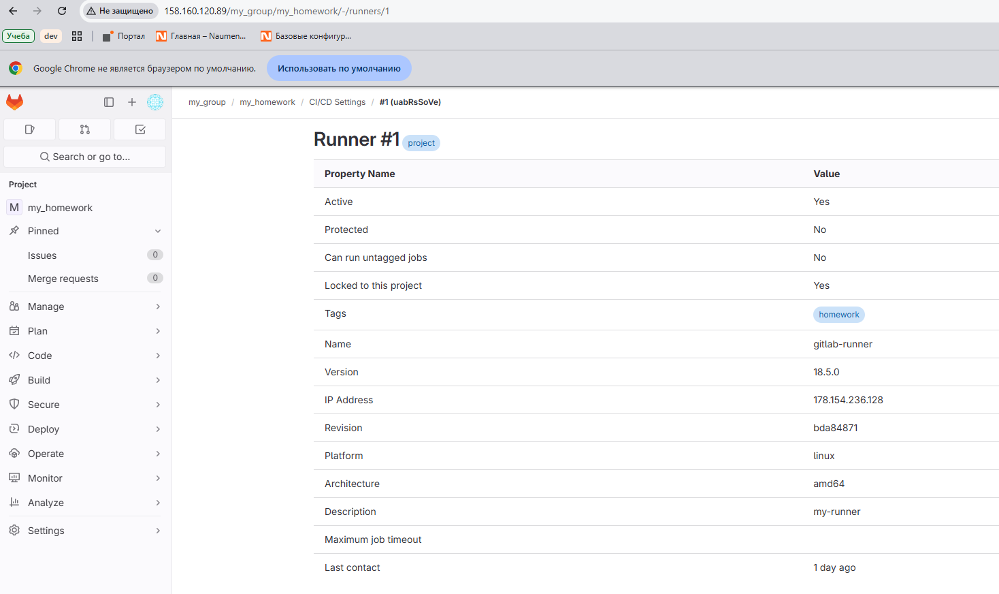
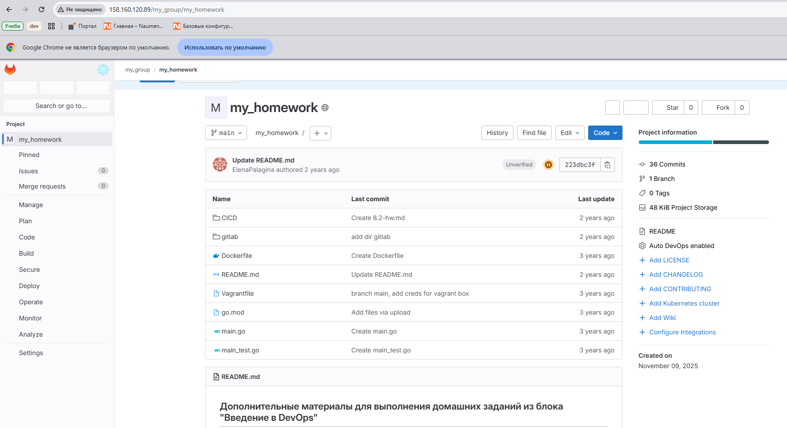
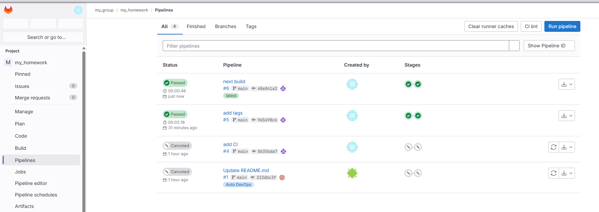

# Домашнее задание к занятию "`GitLab`" - `Рыбянцев Павел`

---
### Задание 1

1. Разверните GitLab локально, используя Vagrantfile и инструкцию, описанные в [этом репозитории](https://github.com/netology-code/sdvps-materials/tree/main/gitlab). 
немного отклонился от дз, сделал в облаке
  
2. Создайте новый проект и пустой репозиторий в нём.

3. Зарегистрируйте gitlab-runner для этого проекта и запустите его в режиме Docker. Раннер можно регистрировать и запускать на той же виртуальной машине, на которой запущен GitLab.

---

### Задание 2

**Что нужно сделать:**

1. Запушьте [репозиторий](https://github.com/netology-code/sdvps-materials/tree/main/gitlab) на GitLab, изменив origin. Это изучалось на занятии по Git.

2. Создайте .gitlab-ci.yml, описав в нём все необходимые, на ваш взгляд, этапы.

[файл .gitlab-ci.yml](/.gitlab-ci.yml)

---